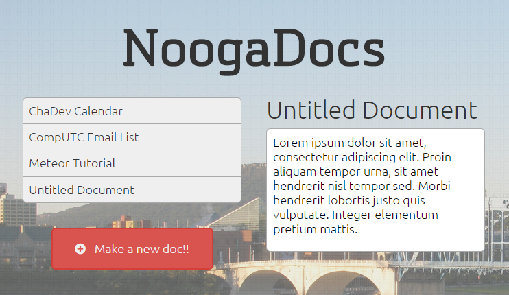

This was assembled for a techtalk at the [Chattanooga Developer Lunches](http://www.meetup.com/chadevs).

The project was to exhibit the capabilities of Meteor by attempting to mock some of the features of GoogleDocs. [You can try the application for yourself.](http://noogadocs.meteor.com) It doesn't yet support synchronous collaboration, since it updates the database by value and not by diff.

The presentation was included in this repository, but has also been uploaded to [SlideShare](http://www.slideshare.net/arcym/introduction-to-meteor-at-chadev-lunch).
